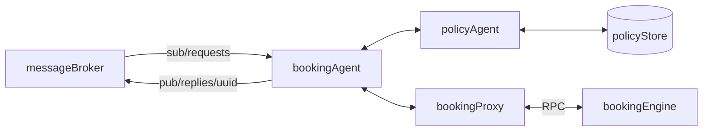
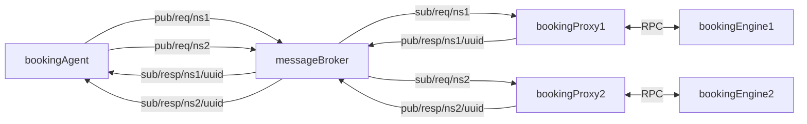

# bookable
Booking engine with arbitrary integer intervals

## Introduction

Use `bookable` to answer the question **"Is this object bookable?"** 

It guarantees to 

- accept booking requests that do not overlap with any existing bookings for that object
- reject all other requests.

There are a number of features it may offer, including

- health
- readiness (will wait until bookings loaded from DB)
- CRUD for namespaces 
- CRUD for objects in namespaces
- CRUD for bookings over future intervals of objects in namespaces
- configurable options include
  - use external SQL for backing up bookings
  - use external NTP server (useful for mock time during integration testing)
  - listening port
  - logging (e.g. to ELK stack, or at least to file which can be sent to ELK stack with beats)
 
## Definitions

An object is a bookable resource, while a subject is an entity that wishes to book an object, as summarised in this table:

| Noun | description | ID created by |
|-------|--------|------|
| object | bookable resource | bookable |
| subject | booking requester/owner | external |

It refers to objects and subjects by arbitrary identification string. The content of the string is conventionally a uuid, but this is not enforced due to lack of well known type in [protobuf](https://github.com/protocolbuffers/protobuf/issues/2224). 


- It exerts no opinions on the duration, timing or mutability of any booking requests. 
- It holds no information about the objects or subjects.
- The booking engine is expected to be used only by trusted entities, so that authN, authZ can be handled in one or more ways as required by the larger system




## Features

TODO: These features need re-drafting to match the verbs for a resource-oriented approach (rather than the natural language verbs of a booking system, e.g. cancel -> delete)


| Feature             | Status  | Comment |
|---------------------|---------|---------|
| Identify object     | TODO v1 | arbitary string (convention: uuid)  |
| Identify subject    | TODO v1 | arbitrary string (convention: uuid) |
| Add object          | TODO v1 | |
| List all objects    | TODO v1 | requires pagination |
| Delete object       | TODO v1 | |
| Export all bookings         | TODO v1 | requires pagination |
| Import (replace) all bookings | TODO v1 | |
| Export bookings for object | TODO v2 | |
| Import (replace) bookings for object | TODO v2 || 
| Get all bookings for object  | TODO v1 | pagination required |
| Get all bookings for subject | TODO v1 | pagination required |
| Get bookings for object within closed interval | TODO v2 | pagination required|
| Get bookings for subject within closed interval | TODO v2 | pagination required|
| Get bookings for object within open interval | TODO v2 | pagination required|
| Get bookings for subject within open interval | TODO v2 | pagination required|
| Get availability for object within interval | TODO v3 | is the inverse of bookings, requires pagination|
| Request multiple bookings   | maybe   | benefit is unclear |
| Book now            | TODO v1 |         |
| Book later          | TODO v1 |         |
| Update booking before start | TODO v1 | Change start and/or end, i.e. delay, extend | 
| Delete before start | TODO v1 | delete  |
| Delete after start  | TODO v1 | this is an update  |
| Check policies      | never   | this is a separate concern   |
| Describe object     | never   | this is a separate concern   |
| Describe subject    | never   | this is a separate concern   |
| Support time-zones  | TODO v1 | support time-zones natively with RCC3339  |
| Namespaces          | maybe   | can namespace by spinning up separate instances ?|
| Purge stale bookings | TODO v1 | avoid memory leakage |
| Report status | TODO v1 | Total nuy,ner pof bookings|
| Report health | TODO v1 | |
| Configure pagination session expiry | TODO v1 | |
| Configure listening port | TODO v1 | |
| Configure storage | TODO v1 | SQL? noSQL? |
| Multi-threaded?   | maybe | will at least intend to use pool of go-routines |
| Configure time server | TODO v2 | will need to mock for testing |
| caching of data | TODO v4 | performance/cost consideration rather than functionality issue |


## Use cases

There are a number of basic features we would expect to (eventually) support, and some we would not.

For example, we want to track who has booked what, but we don't want to know how to describe either of them.
We also do not want to enforce any policies - almost any policy we think up as being generally applicable will have some exception. 
Except, we probably want to reject bookings in the past.

### slots or actual kit - either is fine
An object could be a slot, or an actual experiment, and there could be a mixture of slot and actual experiment bookings in the same instance of bookable, because it does not have an opinion about what the object is - it just has a name.

### time-based permissions

since objects are just a uuid reference, they could also represent other time-based objects like a permission to book during a certain period. This would be helpful in expanding on keto in managing security for booking slots/experiments. Imagine a security proxy which checks if a booking agent has booked an object that is "live" at the present time (the time the booking is being requested), and whether the interval being requested is within another booking representing the usage window of the object that is being booked. The uuid would need to relate to a booking policy, e.g. that included a list of experiments that could be booked in that interval, or alternative, a list by object of booking policies, which you can query to see if any are live at the present time.

I want to book _object_, what policies am I authorised to book it under (in terms of requesting the booking now)?
Are any of those policies currently "live"?
Ok, if they are, what policies cover the interval that I am making the booking for?
Are any of those policies live over the entire duration I wish to book?


### The sorts of complications of policies

We will push policies outside scope of bookable because it would be better to code new policies in go, rather than trying to anticipate use cases and provide scripting language or plugins or whatever. Just implement a new microservice that is authorized to book on behalf of the particular subjects and objects.

E.g . **Allow exploration when others have finished initial allowance**

In a class with a credit-bearing activity, students are likely to repeat the exercises multiple times in order to polish their grade. This is not quite the same as exploring. In order to prevent grade polishing, but permit exploring - or indeed, just to ensure everyone gets a chance on the system before the grade-polishing starts, there could be value in providing a lock on exceeded a stated allownace, until the whole class (or significant percentage) have had at least one session. It gets quite tricky reasoning about this. One possible issue is with multipart labs where there is insufficient throughput for everyone to do it at the last minute. Therefore, should the exercises be broken down into staged exercises to enfore multiple last-minute phases?

Take, for example, 250 students, two exercises of 90 minutes each, and either 10 or 20 items of equipment.

Allow 9 hours a day of prime time, or 90/180 hours in total for 10/20 kits, in other words, 60/120 student-sessions per day. Technically, the whole class can do an exercise in 250 sessions / 60 sessions/day ~ 4.5/1.25 days (one week/half a week). Therefore, we'd need to access the history.

So we would want to add some other agent with READ access only to the SQL database.


## Implementation details


### Request parameters


allow requests to set a correlation id to help with troubleshooting with the logs

### module design

Anticipate that policy enforcer will want read access to our database -> implies we should import the table format from a different module.


### Security

we need some way of allowing different booking agents and policy enforcers to share bookable, without security issues. We assume a security proxy in front of this service, because opinions about how to implement that will surely change. Also, oathkeeper relies on routings but we use gRPC, whereas keto can be used as a decision point in the security proxy - can this bookingagent book this namespace:object, at the current time, for the interval requested? 

funnily enough, it might make sense to have a second version of bookable supporting these time-based policies, represented as bookings. So you add a booking that represents when a booking agent can let users book, and another that represents when the bookings can be made for (e.g. you open bookings in advance of the usage session)


### SQL's BETWEEN operator

Just to rehearse the argument for not using SQL directly ... it _could_ be done, but at a performance penalty compared to a native approach that understands intervals.

The [BETWEEN](https://www.w3schools.com/sql/sql_between.asp) operator can work on a single value like a date, but not an interval. Finding overlaps would require four operations

0. Find anything starting during the requested booking session
```
SELECT * FROM Bookings
WHERE Nbf BETWEEN 2024-05-23T14:25:00  AND 2024-05-23T15:25:00
```
0. Find anything finishing during the requested booking session
```
SELECT * FROM Bookings
WHERE Exp BETWEEN 2024-05-23T14:25:00 AND 2024-05-23T15:25:00
```

0. Find anything starting before, and ending after the session (this is probably incorrect syntax)
```
SELECT * FROM 
( SELECT *
FROM Bookings
WHERE Nbf < 2024-05-23T14:25:00)
WHERE Exp > 2024-05-23T15:25:00
```

To construct an availability list, we would have to perform a similar series of operations, although ordering by `nbf` would be fine because no valid bookings can overlap.


### Performance vs reliability and availability 

Desirable aspects:

- AVL trees for checking bookings to avoid the performance penalty of listing intervals in a database column.
- store AVL trees in memory, for speed. 
- disk-backed booking store that is robust to pod failure.
- We'd also like some form of horizontal scaling in future, but this can be achieved by assigning namespaces to separate booking instances (see below)

#### SQL

A possible scheme would be to write bookings to a database, with a schema that either has self-joins (single table) or explicit hierarchy across multiple tables (if using SQL).

It probably does not matter a great deal what scheme is used, because the heavy lifting of calculating availability windows will be done using the AVL trees in memory.

Therefore we could consider a table structure like this

| id    | nbf | exp | ns-obj | obj  |  ns-sub | sub |
|-------|-----|-----|----|------|------|
| uuid  | datetime | datetime | uuid | uuid | uuid | uuid |

Note that objects and subjects quite possibly have different namespaces.


[RFC3339 could be stored as either an integer datetime or a string, with some opinions suggesting integer unix time stamp: [how to parse time from sql?](https://stackoverflow.com/questions/39988506/what-is-best-practice-when-storing-rfc3339-time-in-a-mysql-database). [go-sql-driver/timetime-support](https://github.com/go-sql-driver/mysql#timetime-support)


Then we have the issue of how to purge stale bookings, to manage memory, which can be done efficiently with table partition switching:  [purge stale data](https://www.mssqltips.com/sqlservertip/5921/delete-data-from-large-sql-server-tables-with-minimal-logging/)?

#### noSQL

On the other hand, if we simply have unstructured data, then we can take advantage of object expiry in redis, and store the information about each booking as a [volatile hash](https://forum.redis.com/t/expiring-keys-in-redis-hash/830/3).

Redis can use a similar main + 2 replicas approach as for kubegres: https://www.containiq.com/post/deploy-redis-cluster-on-kubernetes

There is at least one [go client](https://github.com/go-redis/redis)

Redis supports 32 databases (by number), so we will need to ensure that we coordinate between different microservices that wish to use redis. We can also add an additional layer of protection by namespacing our keys (prefix with namespace, e.g. `booking:some_booking_id`

However, our primary read operation from the redis (or other) dB will be to read out all the keys. This is [discouraged in production](https://scalegrid.io/blog/redis-iterating-over-keys/) because redis is single threaded and will block (not to mention, sending a huge amount of data).

So ... We can be smarter....

use sorted sets for objects and subjects based on `nbf` with unsorted sets containing object-namespaces, and subject-namespaces, with further unsorted sets for each objects-namespaces, and subject-namespace, containing the objects and subjects respectively. Subject-namespaces are duplicate information and are probably not needed (any subject sorting can be done in memory by bookable, thus avoiding any possiblity of conflicting data between these two representations).

To re-load all the data into memory, it is only necessary to read all the keys in the object-namespaces list, then iterate over it, getting each time a list of objects in that namespace. Then for each object in the namespace, iterate over the list of bookings. The [Scan command can be used for that](https://scalegrid.io/blog/redis-iterating-over-keys/), although note that it can return duplicates (this presumably is not an issue if we add a booking that is already added - it will be rejected due to the overlap - and we can hopefully rely on entries only being made in the redis database if they did not overlap at the time the booking was made. There is no chance of race conditions because bookings are suspended during the startup phase of reading from the dB).

And advantage of the redisDB approach is that the export/import can be as simple as restarting the database, if no other user is using it. That likely won't be the case, so an export _could_ be done by doing the database read - and streaming each booking to the client that requested the export. 


#### A file

Another option would be just to write each successful transaction to a file. The file can be played back. And then we are back to [RDB system](https://www.atomikos.com/Documentation/LogCloud).


[Note on shared nature of cloud storage when it comes to separating tx log and db](https://dba.stackexchange.com/questions/33175/sql-server-transaction-logs-in-the-cloud)

#### What about history?

An advantage of the postgres approach is that we already have the kubegres instance, and separate tables with names are less of a configuration hazard than numbered databases. We don't seem to get many benefits here from redis, and it seems like choosing a dB that can't just dump us all our rows. Postgres has multiple processes, not that we would take new bookings while still reading out from the database.

One possibility that would be nice would be to take stale bookings from the bookings table and insert them into a history table. That would avoid reading a year or two of history data and throwing it away, while waiting to get to the bookings that are still in the future (but we'd have to read back that far to make sure we didn't miss any bookings made really really far out).

[Vertical scaling handles large tables ok](https://dba.stackexchange.com/questions/298963/postgres-select-on-a-very-large-table) although inefficient filters kills throughput.

So can we `cron` a daily job to expire old bookings over to the history table?

History tables are discussed 
[in terms of insert performance](https://stackoverflow.com/questions/15211142/moving-the-data-from-transaction-table-to-history-table-to-increase-insert-perfo)
[and here in terms of read performance](https://stackoverflow.com/questions/35837354/efficient-way-to-move-large-number-of-rows-from-one-table-to-another-new-table-u)

One strategy could be to maintain a single table, with all bookings in it, and when doing a recovery, select only for expiries that have not already occurred.

What quantity are we talking?

Let's assume a 10sec check booking and a 5 min user booking for every equipment, 24/hours a day, 7 days a week, ramping from 200 to 10,000 experiments over 10 years

That would generate: 
(200 + 10,000)/2 = 5,100 experiments on average
24*3600 / (5*60 + 10) = 278 bookings a day per kit
10*365= 3,650 days
so we would have 5,100 * 3,650 * 278 = 5,174,970,000 or around 5,200 Billion entries.

Mmm. That's a lot. Maybe the example is too agressive. Let's try again ....

130 experiments growing annually by 100 experiments for 5 years, being used for 24 sessions a day each, for 30% of the year, with checking taking place during the same booking

Now we have 130 experiments growing to 630 experiments, or 365 equivalent experiments for the whole time
With 5 * 365 days per year * 48 sessions * 0.3 utilisation = 26,280 per equivalent experiment over 5 years
For a total of 9 million rows. Millions of rows does not seem to be an issue.

[if it did matter, declarative partitioning might help](https://stackoverflow.com/questions/45629767/postgres-performance-for-a-table-with-more-than-billion-rows)

Note: with 500 experiments at 26,280 bookings/year we'd probably have 2-3M bookings in a year if it was super heavily used. But if usage on each course is only for an intensive month, then utlisation is closer to 4weeks/52weeks, or 0.08, with hour long experiments, so 130 experiments * 12 sessions/day * 365 days * 0.08 utilisation so initially we'd be tackling 45K rows.

So ... we would simply need to monitor the size of the table, and the performance of the booking system, and retain only bookings from say, the last 12 months. Could run a daily or monthly purge of old bookings to cold-storage. It's not an urgent problem to handle millions of booking rows (and we can do that by vertical scaling the postgres nodes).

### Horizontal scaling

Horizontal scaling is a future requirement, rather than an immediate one. 

ReplicaSets would rely on some form of eventual consistency, that is inappropriate for a booking system due to possibility of race conditions between different users booking the same thing through different instances of the booking agent. 

Stateful sets offer a better approach, with each instance each associated with a namespace. The namespaces are probably best organised along tenancy or organisation lines, ensuring that namespaces do not grow beyond the bounds of reasonable performance limits. There are wider system implications, e.g. our kubegress set up has a single main node, so we'd need to worry about how to scale that too.




We could consider eventual consistency when it comes to making bookings, but it probably almost immediately will results 

If we use a stateful set, we could have a single instance of the booking system running in memory. It can send its transactions to a high availabilty database, e.g. kubegres (if we went for SQL).


We probably want to cache some availabilty results

We want to store our transactions in a reliable database. For example, we might wish to have a master database and two replicants. We could a


### gRPC

gRPC allows us to define an HTTP1.1 API (e.g. for dashboard) as well as HTTP 2/Protocol buffers interface. A resource-oriented design is [good practice](https://cloud.google.com/apis/design/resources) , regardless of whether an HTTP 1.1 API is used. 

### Pagination


[Jontro](https://stackoverflow.com/questions/36993720/pagination-in-grpc):
> Google have themselves written up a good design document about this: https://cloud.google.com/apis/design/design_patterns#list_pagination

> - define a string field page_token in the List method's request message. The client uses this field to request a specific page of the list results.
> - define an int32 field page_size in the List method's request message. Clients use this field to specify the maximum number of results to be returned by the server. The server may further constrain the maximum number of results returned in a single page. If the page_size is 0, the server will decide the number of results to be returned.
> - define a string field next_page_token in the List method's response message. This field represents the pagination token to retrieve the next page of results. If the value is "", it means no further results for the request.
> The part about using FieldMask for partial responses is also worth a read since this is a common api design pattern


### Long-running operations

We shouldn't need to implement any long-running operations unless the booking engine becomes non-performant due to lack of resources, and then 


### Logging

We need to include correlation ids in our logs ... we might want to include the correlation id as a field in the request

[logging for microservices](https://www.developer.com/design/logging-microservices/)
